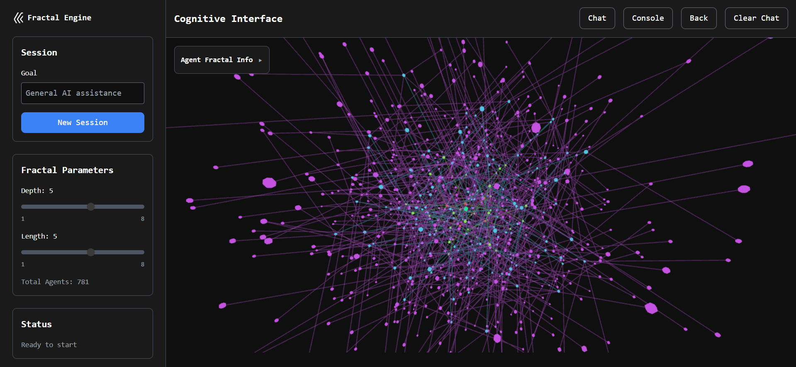
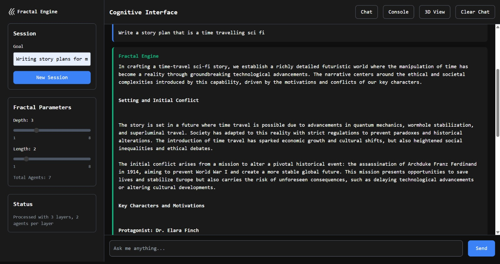
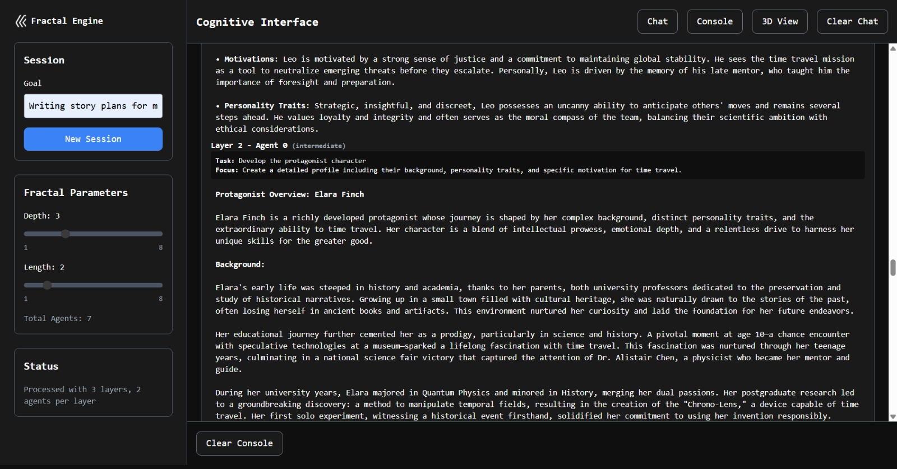

# Fractal Engine - AI Cognitive Intelligence



### AI-Powered Cognitive Intelligence Through Fractal Agent Processing

A recursive fractal-based AI engine that implements cognitive intelligence through layered agent processing. Built on the principles of fractal reasoning, this system creates emergent intelligence by decomposing complex tasks into specialized sub-agents that work collaboratively to provide comprehensive responses.

## 🚀 Features

- **🌀 Fractal AI Processing**: Recursive agent delegation up to 8 layers deep with 8 agents per layer
- **🧠 GPT-4o Integration**: Powered by OpenAI's most capable model with function calling
- **💬 Modern Chat Interface**: Clean, responsive interface with markdown rendering
- **📊 3D Fractal Visualization**: Interactive Three.js visualization of agent processing trees
- **📋 Real-time Console Logging**: Detailed execution logs showing fractal processing in action
- **🎯 Goal-oriented Sessions**: Set specific objectives for targeted AI assistance
- **⚡ Smart Processing**: Only activates fractal system for complex queries requiring delegation
- **🔧 Custom Functions**: Create and manage custom AI functions with JavaScript execution support
- **💾 Persistent Data Storage**: Automatic saving of chats, console logs, executions, and project settings
- **🌐 Global Function Library**: Share functions across projects with individual toggle controls
- **📈 Advanced Modifiers**: Fine-tune agent distribution patterns across fractal layers

## 🏗️ Architecture

The Fractal Engine implements a hierarchical reasoning system:

### Core Concepts:
- **Root Agent**: Single GPT-4o agent that decides when to delegate tasks
- **Fractal Delegation**: Complex tasks are broken into specialized subtasks
- **Layer Processing**: Each layer can further delegate or execute directly
- **Synthesis**: Results are synthesized back up the tree for comprehensive responses

### Parameters:
- **Depth (1-8)**: Maximum number of recursive delegation layers
- **Length (1-8)**: Maximum number of agents per layer when delegating
- **Total Agent Calculation**: Dynamically calculated based on actual task complexity

## 📋 Prerequisites

- Node.js 18.x or higher
- OpenAI API key with GPT-4o access

## 🛠️ Installation & Setup

### 1. Clone and Install
```bash
git clone <repository-url>
cd fractal-engine
npm install
```

### 2. Environment Configuration
Create a `.env` file in the root directory:
```env
OPENAI_API_KEY=your_openai_api_key_here
PORT=3000
```

### 3. Build Tailwind CSS
```bash
npm run build:css
```

### 4. Start the Server
```bash
# Development mode with auto-restart
npm run dev

# Production mode
npm start
```

### 5. Access the Application
Open your browser to `http://localhost:3000`

## 📖 Usage Guide

### Getting Started:
1. **Add your OpenAI API key** to the `.env` file
2. **Set your parameters**:
   - **Depth**: How many layers deep the fractal can go
   - **Length**: How many specialized agents can be created per layer
   - **Goal**: The overarching objective for your session

3. **Create a New Session** to initialize the AI system

4. **Start chatting** - simple queries get direct responses, complex ones trigger fractal processing

### Interface Tabs:
- **Chat**: Main conversation interface with markdown rendering
- **Console**: Detailed logs of fractal execution when triggered
- **3D View**: Interactive visualization of the agent processing tree


*Clean chat interface with markdown rendering and real-time processing*

### Example Interaction Flow:
```
User: "Analyze the pros and cons of renewable energy"
  ↓
Root Agent: Determines this needs specialized analysis
  ↓
Delegates to 3 agents:
  • Economic Impact Specialist
  • Environmental Impact Analyst  
  • Technical Feasibility Expert
  ↓
Each agent provides detailed analysis
  ↓
Root Agent: Synthesizes all perspectives into comprehensive response
```

## 🔧 Configuration

### Agent Limits:
- **Maximum agents per session**: 4,100
- **Default starting values**: Depth 3, Length 3 (up to 13 agents)
- **Performance consideration**: Higher settings create exponentially more processing

### Fractal Processing:
- Only activates for complex queries requiring specialized analysis
- Simple queries receive direct responses for efficiency
- Agent count is dynamic based on actual task complexity

### Modifiers:
Modifiers control how agents are distributed across fractal layers, allowing for different growth patterns beyond the default flat structure.

**Available Modifier Types:**

#### Flat (Default)
Every layer has the same number of agents, creating consistent exponential growth.
- **Formula**: `agents[layer] = length^layer`
- **Example**: Depth 3, Length 3 → [1, 3, 9] agents per layer
- **Total Agents**: 1 + 3 + 9 = 13 agents
- **Use Case**: Balanced, consistent analysis across all layers

#### Subtract
Starts at maximum agents and decreases each layer until reaching 1.
- **Formula**: `agents[layer] = max(1, length - layer + 1)`
- **Example**: Depth 4, Length 5 → [5, 4, 3, 2] agents per layer
- **Total Agents**: 5 + 4 + 3 + 2 = 14 agents
- **Use Case**: Broad initial exploration with focused deeper analysis

#### Add
Starts small and increases until final layer matches base length.
- **Formula**: `agents[layer] = min(length, layer + 1)`
- **Example**: Depth 4, Length 5 → [1, 2, 3, 4] agents per layer
- **Total Agents**: 1 + 2 + 3 + 4 = 10 agents
- **Use Case**: Focused start with comprehensive final synthesis

#### Shrink Divided
Each layer equals base length divided by layer number (rounded up).
- **Formula**: `agents[layer] = max(1, Math.ceil(length / layer))`
- **Example**: Length 8, Depth 5 → [8, 4, 3, 2, 1] agents per layer
- **Total Agents**: 8 + 4 + 3 + 2 + 1 = 18 agents
- **Use Case**: Rapid focus narrowing for targeted analysis

#### Grow Divided
Opposite of Shrink Divided, starting small and ending at base length.
- **Formula**: `agents[layer] = max(1, Math.ceil(length / (depth - layer + 1)))`
- **Example**: Length 8, Depth 5 → [1, 2, 2, 3, 8] agents per layer
- **Total Agents**: 1 + 2 + 2 + 3 + 8 = 16 agents
- **Use Case**: Building complexity toward comprehensive final analysis

**Mathematical Constraints:**
- **Agent Limit**: All modifiers respect the 4,100 total agent limit
- **Minimum Agents**: Every layer has at least 1 agent
- **Layer Calculation**: Only counts layers that actually delegate (have child agents)
- **Dynamic Adjustment**: Agent counts adjust based on actual delegation decisions

**Performance Comparison:**
```
Configuration: Depth 4, Length 4

Flat:           [1, 4, 16, 64]  = 85 agents
Subtract:       [4, 3, 2, 1]    = 10 agents  
Add:            [1, 2, 3, 4]    = 10 agents
Shrink Divided: [4, 2, 2, 1]    = 9 agents
Grow Divided:   [1, 2, 2, 4]    = 9 agents
```

All modifiers ensure minimum 1 agent per layer and respect the 4,100 agent session limit.


*Console view showing detailed agent execution across fractal layers*

## 🔧 Custom Functions System

The Fractal Engine includes a powerful custom functions system that allows you to extend AI capabilities with your own functions and JavaScript code execution.

### Function Types

**Available Function Types:**
- **function**: Standard OpenAI function calling format
- **python_code**: Execute Python code snippets (requires Python environment)
- **web_search**: Search the web for current information
- **file_operations**: Read, write, and manipulate files
- **data_analysis**: Analyze and process data sets
- **api_calls**: Make HTTP requests to external APIs

### Creating Functions

1. **Navigate to Functions Tab**: Click the "Functions" tab in the interface
2. **Add New Function**: Click "Add Function" button
3. **Fill Function Details**:
   - **Name**: Unique function identifier
   - **Description**: What the function does
   - **Type**: Choose from available function types
   - **Parameters**: Define input parameters (JSON Schema format)
   - **JavaScript Code** (Optional): Add custom JavaScript execution

### JavaScript Code Support

Functions can include optional JavaScript code that executes alongside the function call:

```javascript
// Example: Data processing function
function processData(inputData) {
    const processed = inputData
        .filter(item => item.value > 0)
        .map(item => ({
            ...item,
            processed: true,
            timestamp: new Date().toISOString()
        }));
    
    console.log(`Processed ${processed.length} items`);
    return processed;
}

// Return result to the AI system
return processData(parameters.data);
```

**JavaScript Features:**
- Full ES6+ syntax support
- Access to function parameters via `parameters` object
- Console logging for debugging
- Return values passed back to AI system
- File system access for data persistence

### Global vs Local Functions

**Local Functions:**
- Created within a specific project
- Only available in that project
- Can be edited and deleted
- Stored in project-specific settings

**Global Functions:**
- Available across all projects
- Stored in `/functions/` directory with individual folders
- JavaScript files saved to `/functions/scripts/`
- Cannot be edited from project interface (for consistency)
- Project-level toggle controls for enabling/disabling

### Function Management

**Function Cards Display:**
- **Status Indicator**: Green checkmark when enabled, unchecked when disabled
- **Function Name**: Click card to toggle enable/disable
- **Type Badges**: 
  - `GLOBAL` (purple): Function available across projects
  - `LOCAL` (blue): Project-specific function
  - `JS` (yellow): Function includes JavaScript code
- **Action Buttons** (Local functions only):
  - **Edit**: Modify function details and code
  - **Delete**: Remove function from project

**Auto-Save Functionality:**
- All function changes are automatically saved
- Toggle states persist across sessions
- JavaScript code is saved to appropriate directories
- Project settings maintain function enable/disable states

### File Structure

```
/functions/
├── scripts/                    # JavaScript execution files
│   ├── my_function.js         # Generated from function JS code
│   └── data_processor.js      # Another function's JS code
├── {functionId-1}/            # Individual function folders
│   └── metadata.json          # Function configuration
├── {functionId-2}/
│   └── metadata.json
└── ...
```

## 💾 Data Persistence & Storage

The Fractal Engine automatically saves all your data to ensure nothing is lost between sessions.

### What Gets Saved

**Chat Data:**
- Complete conversation history with timestamps
- Message content with markdown formatting
- User queries and AI responses
- Associated execution metadata

**Console Logs:**
- Real-time agent execution logs
- Layer-by-layer processing details
- Agent status updates and completion states
- Performance metrics and timing data

**Execution Records:**
- Complete fractal processing trees
- Agent delegation decisions and reasoning
- Individual agent responses and synthesis results
- 3D visualization data for replay

**Project Settings:**
- Fractal parameters (depth, length, modifiers)
- Session goals and descriptions
- Function enable/disable states
- UI preferences and configurations

### Storage Structure

```
/data/
└── projects/
    └── {projectId}/
        ├── metadata.json          # Project info and settings
        ├── chats/                 # Chat conversations
        │   └── {chatId}.json     # Individual chat data
        ├── console-logs/          # Execution logs
        │   └── {executionId}.json # Detailed execution data
        └── settings.json          # Project-specific settings
```

### Auto-Save Features

- **Real-time Saving**: Changes saved immediately as they occur
- **Background Persistence**: No user intervention required
- **Cross-session Continuity**: Resume exactly where you left off
- **Data Integrity**: Atomic writes prevent data corruption
- **Backup Redundancy**: Multiple save points for critical data

## 📊 Console Logging & Execution Tracking

The Console tab provides detailed insights into the fractal AI processing system.

### Live Execution Status

When fractal processing is active, the console shows:

**Live Status Box:**
- ⚡ Processing indicator with animation
- Real-time agent status updates
- Progress tracking (completed/total agents)
- Individual agent focus areas and completion states

### Execution Logs

**Execution Entries:**
- **Timestamp**: When the execution started
- **Query Preview**: The original user question
- **Agent Count**: Total number of agents created
- **Status**: Processing, Completed, or Failed
- **Expandable Details**: Click to view full execution tree

### Detailed Agent Information

**Agent Cards Show:**
- **Agent Focus**: Specialized task or domain
- **Layer Information**: Which fractal layer the agent operates on
- **Execution Status**: Pending → Running → Completed
- **Response Content**: Full agent responses and reasoning
- **Synthesis Results**: How agent outputs were combined

### Execution Tree Visualization

**Hierarchical Display:**
- **Layer Organization**: Agents grouped by fractal layers
- **Parent-Child Relationships**: Clear delegation chains
- **Status Indicators**: Visual progress tracking
- **Expandable Sections**: Drill down into specific agent details
- **Response Content**: Full text of agent outputs

### Performance Metrics

**Timing Information:**
- Start and completion timestamps
- Individual agent execution times
- Layer processing durations
- Total query processing time
- Performance optimization insights

## 🎥 3D Fractal Visualization

The 3D View tab provides an interactive Three.js visualization of the fractal agent processing tree.

### Real-time Visualization

**Dynamic Tree Building:**
- Nodes appear as agents are created and executed
- Color-coded status indicators (pending, running, completed)
- Animated connections showing parent-child relationships
- Real-time updates during fractal processing

### Interactive Features

**Camera Controls:**
- **Mouse**: Rotate view around the fractal tree
- **Scroll**: Zoom in/out for detailed or overview perspectives
- **Auto-rotation**: Optional continuous rotation for presentation mode
- **Reset View**: Return to default camera position

**Node Information:**
- **Hover Effects**: Highlight nodes and connections on mouse over
- **Click Details**: Display agent information in overlay
- **Layer Grouping**: Visual separation of fractal layers
- **Status Colors**: 
  - Gray: Pending/queued agents
  - Blue: Currently executing agents
  - Green: Successfully completed agents
  - Red: Failed or errored agents

### Visualization Patterns

**Tree Structure:**
- **Root Node**: Single central node representing the root agent
- **Layer Spacing**: Vertical separation between fractal layers
- **Radial Distribution**: Child nodes arranged in circles around parents
- **Connection Lines**: Animated lines showing delegation relationships

**Performance Indicators:**
- **Node Size**: Proportional to processing time or complexity
- **Animation Speed**: Faster updates for quicker agent completions
- **Tree Depth**: Visual representation of fractal recursion levels
- **Branch Density**: Shows agent distribution patterns across modifiers

## 🎨 Technology Stack

- **Backend**: Node.js + Express.js
- **AI**: OpenAI GPT-4o with function calling
- **Frontend**: Vanilla JavaScript + Tailwind CSS
- **3D Visualization**: Three.js
- **Markdown**: Custom renderer with syntax highlighting
- **Security**: Helmet.js with CSP

## 📡 API Reference

### Session Management

#### Create Session
```http
POST /api/session
Content-Type: application/json

{
  "goal": "General AI assistance",
  "projectId": "uuid"
}
```

#### Process Query
```http
POST /api/query
Content-Type: application/json

{
  "sessionId": "uuid",
  "query": "Your question here",
  "depth": 3,
  "length": 3,
  "modifier": "flat",
  "force": false
}
```

### Chat Management

#### Save Chat
```http
POST /api/chats
Content-Type: application/json

{
  "projectId": "uuid",
  "chatId": "uuid", 
  "messages": [...],
  "goal": "Session goal",
  "createdAt": "2023-01-01T00:00:00.000Z"
}
```

#### Load Chat
```http
GET /api/chats/{projectId}/{chatId}
```

#### List Chats
```http
GET /api/chats/{projectId}
```

### Console Logs

#### Save Execution Log
```http
POST /api/console-logs
Content-Type: application/json

{
  "projectId": "uuid",
  "executionId": "uuid",
  "executionLog": {
    "query": "User question",
    "startTime": "2023-01-01T00:00:00.000Z",
    "agents": [...],
    "delegationReason": "Complex analysis required"
  }
}
```

#### Load Execution Logs
```http
GET /api/console-logs/{projectId}
```

### Function Management

#### Save Function Script
```http
POST /api/functions/script
Content-Type: application/json

{
  "functionId": "uuid",
  "functionName": "myFunction",
  "jsCode": "function myFunction() { ... }"
}
```

#### Load Global Functions
```http
GET /api/functions/global
```

**Response:**
```json
{
  "functions": [
    {
      "id": "uuid",
      "name": "Function Name",
      "description": "Function description", 
      "type": "function",
      "jsCode": "...",
      "scriptPath": "/functions/scripts/function_name.js",
      "createdAt": "2023-01-01T00:00:00.000Z"
    }
  ]
}
```

### Project Management

#### Load Project Settings
```http
GET /api/projects/{projectId}/settings
```

#### Save Project Settings
```http
POST /api/projects/{projectId}/settings
Content-Type: application/json

{
  "functions": {...},
  "preferences": {...},
  "fractalSettings": {
    "depth": 3,
    "length": 3,
    "modifier": "flat"
  }
}
```

## 🔬 Research & Development

This project is developed by **[Spark Engine](https://sparkengine.ai)**, an AI research company and R&D agency focused on:
- **Agentic AI Systems**
- **Chain-of-Thought (CoT) Reasoning**
- **Cognitive-based AI Research**

### Research Foundation:
The Fractal Engine is inspired by our research on **[Fractal-based Intelligence](https://sparkengine.ai/research/more/fractal-intelligence)**, exploring how recursive, self-similar patterns can enhance AI reasoning capabilities.

## 🌍 Community

**Join our Discord Community**: [https://discord.gg/bMuQ3mWQzc](https://discord.gg/bMuQ3mWQzc)

Connect with other researchers, developers, and AI enthusiasts working on cognitive AI systems, fractal reasoning, and agentic AI architectures.

## 🚀 Deployment

### Vercel (Recommended)
```bash
vercel
```

### Manual Deployment
1. Set environment variables on your hosting platform
2. Run `npm run build:css` 
3. Start with `npm start`
4. Ensure Node.js 18.x+ is available

## ⚠️ Performance & Cost Warnings

> **🚨 CRITICAL WARNING**: High depth/length settings can create **HUNDREDS or THOUSANDS** of agents in a single query, resulting in **EXTREMELY HIGH** OpenAI API costs and processing times. Always test with low values first!

### Cost & Performance Impact:
- **Exponential scaling**: Agent count = Length^Depth per layer
- **Example costs**:
  - Depth 3, Length 3: ~13 agents (safe)
  - Depth 5, Length 5: ~781 agents (expensive)
  - Depth 8, Length 8: ~19,173,961 agents (💸 BANKRUPTCY RISK!)
- **API costs**: Each agent = 1 OpenAI API call (potentially $0.01-0.30+ per agent)
- **Processing time**: Higher complexity can take minutes to complete
- **Memory usage**: Large fractal trees consume significant system resources

### Safe Usage Recommendations:
- **Start small**: Begin with Depth 2-3, Length 2-3
- **Monitor costs**: Check your OpenAI usage dashboard regularly  
- **Test incrementally**: Gradually increase parameters while monitoring performance
- **Set API limits**: Configure spending limits in your OpenAI account
- **Production usage**: Consider implementing cost controls and user limits

## 📄 License

MIT License - See LICENSE file for details

## 🤝 Contributing

We welcome contributions! Please see our contributing guidelines and join our Discord community to discuss ideas and collaborate on advancing fractal-based AI research.

---

**Built with ❤️ by [Spark Engine](https://sparkengine.ai)**  
*Advancing the frontiers of cognitive AI through fractal reasoning*
